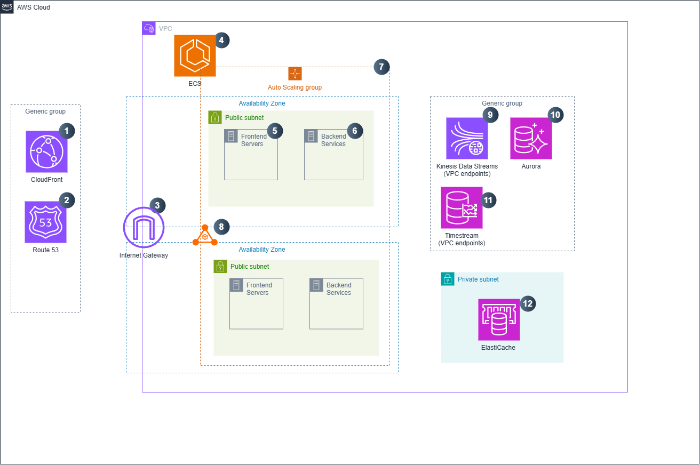

Provide your solution here:

## Architecture

## Explanation
- 1: AWS cloudfront for caching frontend contents to reduce load time
- 2: AWS Route 53 for create domain name for FE and BE server
- 3: VPC Internet Gateway to publish servers to the internet
- 4: ECS to create cluster of EC2 scaling group 
- 5: FE server to serve UI
- 6: BE micro services to handle main logics like bid/ask operations, matching, retrieve crypto prices, validate buying process,...
- 7: I think using the combination of Reserved Instances and EC2 Instance Savings Plans could be a better choice than using AWS Fargate as cluster node
- 8: Application Load Balancer is used to distribute loads to services
- 9: Kinesis Data Streams to collect buy and sell orders to put in ElastiCache and AWS TimeStream for temporary and permanent data for BE service to use
- 10: Aurora to store users permanent like payment account and user balance
- 11: TimeStream to save time-based data of crypto price
- 12: ElastiCache is used for matching process
